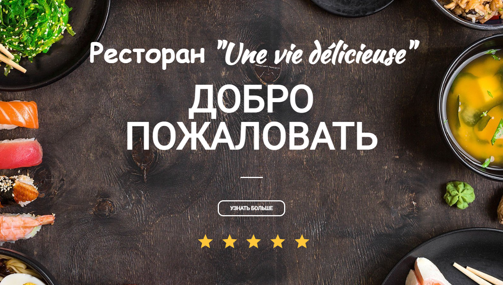
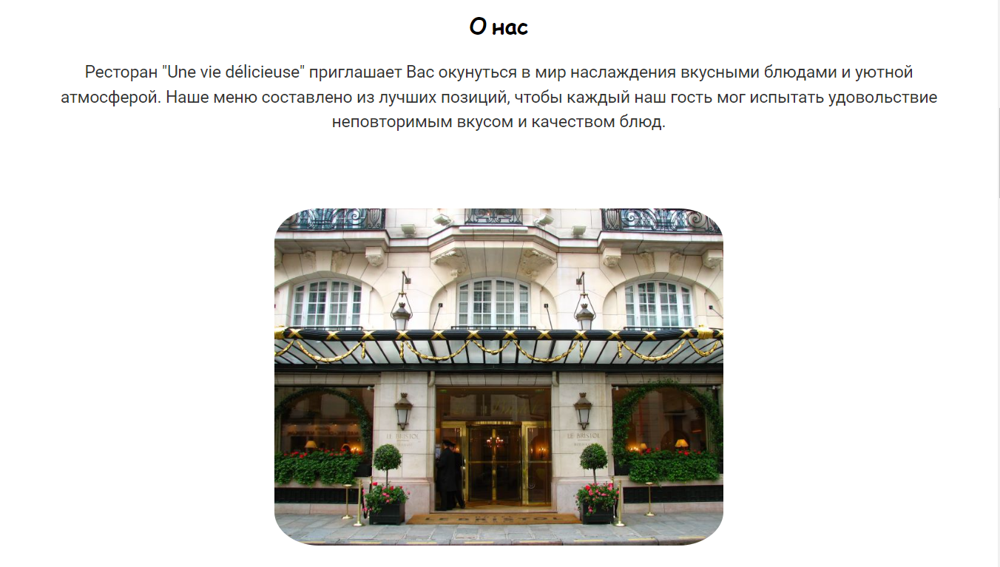
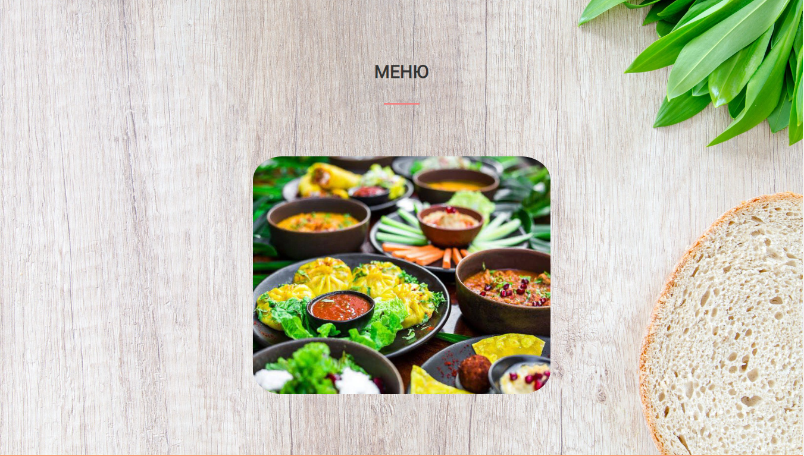
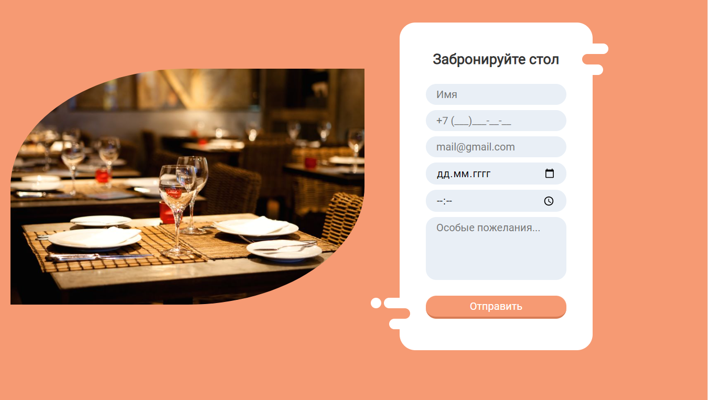
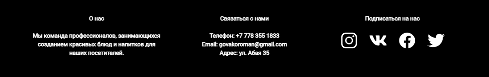

# **Ресторан "Une vie délicieuse"**

*Верстка не расчитана на большие экраны

>## Технологии:

```
Верстка + Мобильная адаптация + Работа с бд + JS + PHP
```

>Установка:

```
1. git clone https://github.com/Skill-g/RestaurantSite.git
2. cd RestaurantSite-main
3. Изменить данные от бд в php файлах, выгрузить на хост, или запустить на локальной машине
4. Готово
```


>Изображения:







